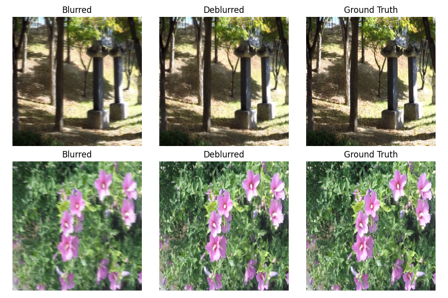

# TransferCLIP for Generalizable Motion Deblurring

## Overview
This repository implements **TransferCLIP**, a data-efficient motion deblurring method that leverages CLIP’s pretrained ResNet‑50 features and a lightweight residual decoder. By freezing most of CLIP’s encoder and fine‑tuning only its last block, TransferCLIP restores high‑frequency details with as few as 1 500 training pairs.

<p align="center">
  
</p>

## Key Features
- **Multi‑scale CLIP features:** taps feature maps at resolutions 64×64, 32×32, 16×16, 8×8
- **Selective fine‑tuning:** only CLIP’s Stage‑4 is unfrozen (LR=1e‑5);
  stages 1–3 remain frozen to preserve blur‑invariant semantics
- **Residual decoder:** predicts a single‑channel residual Δ added to the blurred input
- **Combined loss:** L₁ + 0.1·VGG perceptual loss for pixel accuracy and texture fidelity
- **Small data regime:** trains on 1 500 image pairs with 3 crops each (4500 patches/epoch) and tests on 250 images

## Repository Structure
```
transfer-clip-deblurring/
├── src/                   # Source code (training, testing, baselines)
│   ├── train_deblur.py
│   ├── test_deblur.py
│   ├── baseline_evaluate.py
│   ├── models/            # CLIPFeatureExtractor, DeblurDecoder, VGGLoss
│   ├── datasets/          # GoProDataset loader
│   └── utils.py
├── configs/               # YAML configuration files
│   ├── clip_deblur_small.yaml
│   └── clip_deblur_full.yaml
├── data/
│   └── example/           # Small example blur/sharp pair for sanity check
├── results/               # Sample outputs and plots
├── requirements.txt       # Python dependencies
├── README.md              # You are here
├── LICENSE                # MIT License
```

## Installation

1. **Clone the repository**
   ```bash
   git clone https://github.com/sreenija10007/-TransferCLIP-for-Deblurribg.git
   cd TransferCLIP-for=Deblurring
   ```
2. **Create & activate a Python virtual environment**
   ```bash
   python3 -m venv venv
   source venv/bin/activate
   ```
3. **Install dependencies**
   ```bash
   pip install -r requirements.txt
   ```

## Data Preparation

1. **Download the GoPro dataset** (original release, ~7 GB):
   https://paperswithcode.com/dataset/gopro

2. **Organize data** under `data/gopro_raw/` as:
   ```
   data/gopro_raw/train/blur/*.png
   data/gopro_raw/train/sharp/*.png
   data/gopro_raw/test/blur/*.png
   data/gopro_raw/test/sharp/*.png
   ```

3. **Create train/test splits** (1 500 training pairs, 250 test pairs):
   ```bash
   python scripts/sample_gopro.py
   ```

4. **Example and Results Folders**
   - `data/example/` contains a single blur/sharp pair for a quick sanity check for sake of repo.  
   - `results/` holds sample output images and comparison plots, but is down-sampled to reduce repo size.

## Usage

### Pretrained Model Weights
- The best decoder checkpoint (`best_decoder.pth`) is available here:
  https://drive.google.com/drive/folders/1rSJllYBi_hmWd5OduCQDmAyRx5e_pXNo?usp=drive_link

### Training
```bash
python train_deblur.py --config configs/clip_deblur_small.yaml
```
- Trains decoder + CLIP stage‑4
- Saves best model to `runs/clip_deblur/best_decoder.pth`

### Testing
```bash
python test_deblur.py \
  --config configs/clip_deblur_small.yaml \
  --checkpoint runs/clip_deblur/best_decoder.pth \
  
```
- Produces deblurred images in `results/deblur_test`
- Outputs CSV with PSNR/SSIM metrics

### Baseline Evaluation
```bash
python baseline_evaluate.py 
```
- Computes Wiener and Unsharp metrics on test set

### Plotting Results
```bash
python plot_results.py
```
- Generates `psnr_comparison.png` and `ssim_comparison.png`

## Results
| Method              | PSNR (dB) | SSIM  |
|---------------------|----------:|------:|
| Wiener filter       |    23.39  | 0.708 |
| Unsharp masking     |    27.82  | 0.868 |
| **TransferCLIP**    | **29.89** | 0.878 |

See `results/` for qualitative galleries and comparison plots.

## License
This project is licensed under the MIT License—see [LICENSE](LICENSE) for details.

## Citation
If you use this code, please cite:
```bibtex
@inproceedings{kanugonda2025transferclip,
  title={TransferCLIP for Generalizable Motion Deblurring},
  author={Kanugonda, Sreenija},
  year={2025},
  booktitle={Conference on Computer Vision and Pattern Recognition (CVPR) Workshops}
}
```

